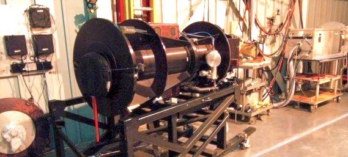

# *PyDIS* 

 

An easy to use reduction package for one dimensional longslit spectroscopy using Python. 

The goal of *pyDIS* is to provide a turn-key solution for reducing and understanding longslit spectroscopy, which could ideally be done in real time. Currently we are using many simple assumptions to get a quick-and-dirty solution, and modeling the workflow after the robust industry standards set by IRAF. Additionally, we have only used data from the low/medium resolution [APO 3.5-m](http://www.apo.nmsu.edu) "Dual Imaging Spectrograph" (DIS). Therefore, many instrument specific assumptions are being made. So far PyDIS has also been successfully used (with hacking/modification) on data from MMT and DCT. **If you use PyDIS, please send me feedback!**

Some background motivation on why I made this package is [given here](http://jradavenport.github.io/2015/04/01/spectra.html).

## Examples
See the [examples page](https://github.com/jradavenport/pydis/wiki/Examples) on the Wiki for a few worked examples of reducing DIS data, or the step-by-step [manual reduction guide](https://github.com/jradavenport/pydis/wiki/Manual-Reduction-Guide) for a detailed tutorial on reducing 1-d spectroscopy data with *pyDIS*.

## Motivation
Really slick tools exist for on-the-fly photometry analysis. However, no turn-key, easy to use spectra toolkit for Python (without IRAF or PyRAF) was available (that we were aware of). Here are some mission statements:

- Being able to extract and see data in real time at the telescope would be extremely helpful!
- This pipeline doesn't have to give perfect results to be very useful
- Don't try to build a *One Size Fits All* solution for every possible instrument or science case. We cannot beat IRAF at it's own game. IRAF is the industry standard
- The pipeline does need to handle:
	- Flats 
	- Biases 
	- Spectrum Tracing
	- Wavelength Calibration using HeNeAr arc lamp spectra
	- Sky Subtraction
	- Extraction
	- basic Flux Calibration
- The more hands-free the better, a full reduction script needs to be available
- A fully interactive mode (a la IRAF) should be available for each task

So far *pyDIS* can do a rough job of all the reduction tasks for single point sources objects! We are seeking more data to test it against, to help refine the solution and find bugs. Here is one example of a **totally hands-free reduced M dwarf spectrum** versus the manual IRAF reduction:

**This spectrum took a few seconds to reduce, and is good enough for a quick-look!** There are definitely errors in the wavelength, and small offsets in the flux calibration. A (terrible) brute-force wavelength solution, and sometimes fickle flux calibration are being used here. With some minimal parameter tweaking and manual lamp-line identifications the results are even better!

## How to Help

- Check out the Issues page if you think you can help code, or want to requst a feature! 
- If you have some data already reduced in IRAF that you trust and would be willing to share, let us know!
